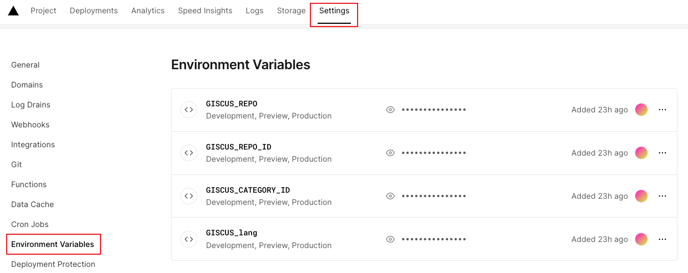

# AstroBlog 博客系统


[](https://conventionalcommits.org)


AstroBlog 是一款开箱即用的博客系统。

该系统基于 [AstroPaper](https://github.com/satnaing/astro-paper) 进行二次开发，在原来系统的基础上增加了一些定制化的功能。

如果你对二次开发的内容感兴趣，可以阅读 [Astro 搭建博客系列]()。

## 系统特色

- [x] 响应式
- [x] 支持 giscus 文档
- [x] 支持评论（giscus）
- [x] 支持 aside 友好提示
- [x] 支持显示阅读时长
- [x] 白天黑夜两个主题
- [ ] 阅读数（开发中...）

## 本地运行

1. 安装依赖(确保 node 版本大于 16）)

```bash
yarn
```

2. 新建 `.env` 文件，写入 giscus 配置（可选）

```text title=".env"
# Giscus Config
GISCUS_REPO=【替换为你的仓库名称】
GISCUS_REPO_ID=【替换为你的仓库id】
GISCUS_CATEGORY_ID=【替换为你的目录id】
GISCUS_lang=【替换为你的默认语言】
```

如何获取 giscus 配置，可以参考

3. 打开浏览器，输入 `http://127.0.0.1:3000/` 即可。

## 远端部署

推荐使用 vercel 一键部署。

1. 点击 [](https://vercel.com/new/clone?repository-url=https%3A%2F%2Fgithub.com%2Fpengzhile%2Fpandora-cloud-serverless)
   创建项目
2. 进入项目 settings，点击 environment-variables，在右侧添加以下环境变量，用于配置评论系统。变量名称参考**本地运行中的第 2 步配置**。
   
3. 如果需要绑定域名，可以在 settings 页面点击 domains 进行配置（可选）

查看[部署示例](https://jizhule.cn/)。

## 反馈与建议

如果有任何的建议或疑问，欢迎提 issue 或者通过<a href="mailto:695601924@qq.com">邮箱</a>联系我。

## License

Licensed under the MIT License, Copyright © 2023

---

Made with ❤️ by [YouQuan](https://jizhule.cn)
